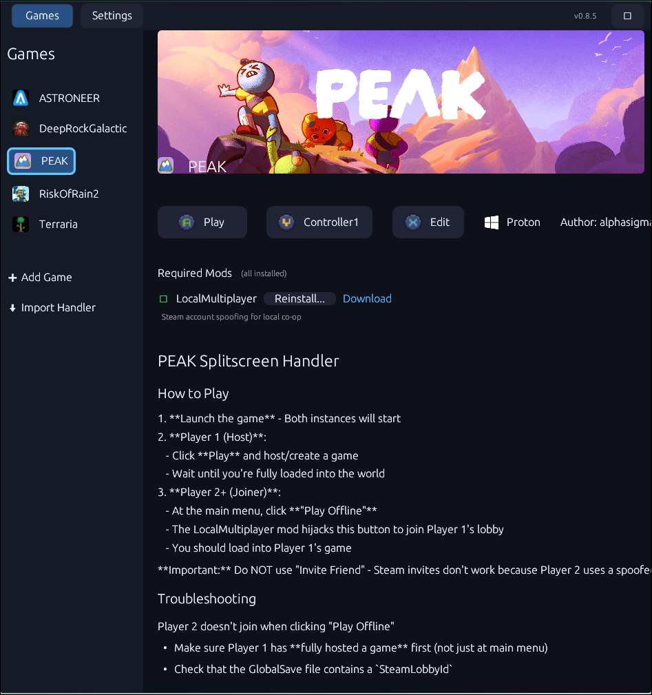
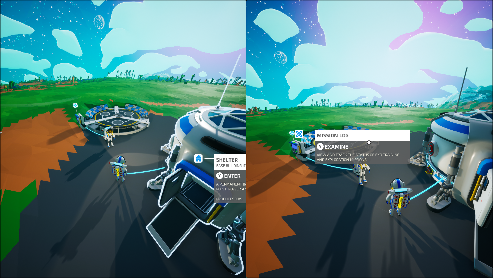

### `Splitux`

A split-screen game launcher for Linux

---

<p align="center">
    
    
</p>

> [!NOTE]
> Splitux is in early development. Contributions and feedback are welcome!

## Features

- Launch multiple game instances with automatic window tiling (up to 4 per monitor)
- Native Linux games and Windows games via Proton/UMU Launcher
- Controller isolation - each instance only sees its assigned controller
- Keyboard and mouse support via custom Gamescope fork
- Multi-monitor support
- Steam multiplayer emulation for LAN play
- Per-player profiles for separate saves and settings
- Works on SteamOS and desktop Linux (KDE Plasma, Hyprland)

## How it Works

Splitux combines several technologies to enable split-screen gaming:

| Component | Purpose |
|-----------|---------|
| [Gamescope](https://github.com/ValveSoftware/gamescope) | Nested Wayland compositor - contains each game instance in its own window, receives input even when unfocused |
| [Bubblewrap](https://github.com/containers/bubblewrap) | Sandboxing - masks input devices so each instance only sees its assigned controller |
| [Goldberg Steam Emu](https://github.com/Detanup01/gbe_fork) | Steam API emulation - enables LAN multiplayer between instances |
| [UMU Launcher](https://github.com/Open-Wine-Components/umu-launcher) | Proton runtime - runs Windows games on Linux |
| [KWin](https://invent.kde.org/plasma/kwin) / [Hyprland](https://hyprland.org/) | Window management - tiles game windows on screen |

## Installation

Download the latest release from [Releases](https://github.com/gabrielgad/splitux/releases).

### SteamOS
Run `splitux` in desktop mode. For Gaming Mode, add `GamingModeLauncher.sh` as a non-Steam game and disable Steam Input.

### Desktop Linux
Install dependencies: KDE Plasma or Hyprland, Gamescope, Bubblewrap, fuse-overlayfs. Run `splitux` from your desktop session.

## Building

Requires Rust (2024 edition), meson, and ninja.

```bash
git clone --recurse-submodules https://github.com/gabrielgad/splitux.git
cd splitux
./splitux.sh build
```

Output will be in `build/`.

## License

MIT License - see [LICENSE](LICENSE)

## Acknowledgments

Built on the shoulders of giants:
- [Gamescope](https://github.com/ValveSoftware/gamescope) by Valve
- [Goldberg Steam Emu](https://github.com/Detanup01/gbe_fork) by Mr_Goldberg & Detanup01
- [UMU Launcher](https://github.com/Open-Wine-Components/umu-launcher) by GloriousEggroll et al.
- [Nucleus Coop](https://github.com/SplitScreen-Me/splitscreenme-nucleus) by the Splitscreen.me team
