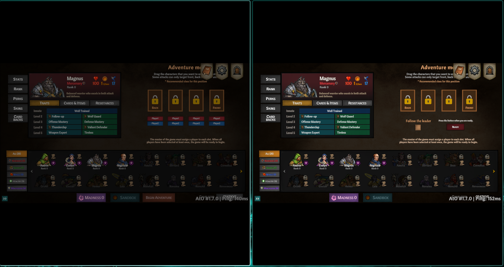

### `Splitux`

Split-screen gaming on Linux

---

<p align="center">
    
</p>

<p align="center">
    
</p>

<p align="center">
    
    <br>
    <em>Across The Obelisk - Two players in the same multiplayer lobby</em>
</p>

## Features

- **Split-screen multiplayer** - Run multiple game instances with automatic window tiling
- **Controller isolation** - Each instance only sees its assigned controllers
- **Keyboard & mouse support** - Per-instance input isolation via custom Gamescope fork
- **Steam artwork integration** - Automatically fetches game icons and banners from your local Steam library
- **LAN multiplayer emulation** - Play online-only games locally via Goldberg Steam Emulator
- **Proton support** - Run Windows games through Proton/UMU Launcher
- **Per-player profiles** - Separate saves, settings, and Steam identities per player
- **Hyprland & KDE Plasma** - Native window manager integration

## How It Works

Splitux launches each game instance inside its own containerized environment:

```
┌────────────────────────────────────────────────────────────┐
│ Splitux                                                    │
│ ┌────────────────┐ ┌────────────────┐ ┌────────────────┐   │
│ │ Gamescope      │ │ Gamescope      │ │ Gamescope      │   │
│ │ ┌────────────┐ │ │ ┌────────────┐ │ │ ┌────────────┐ │   │
│ │ │ Bubblewrap │ │ │ │ Bubblewrap │ │ │ │ Bubblewrap │ │   │
│ │ │ ┌────────┐ │ │ │ │ ┌────────┐ │ │ │ │ ┌────────┐ │ │   │
│ │ │ │  Game  │ │ │ │ │ │  Game  │ │ │ │ │ │  Game  │ │ │   │
│ │ │ └────────┘ │ │ │ │ └────────┘ │ │ │ │ └────────┘ │ │   │
│ │ └────────────┘ │ │ └────────────┘ │ │ └────────────┘ │   │
│ │ Player 1       │ │ Player 2       │ │ Player 3       │   │
│ └────────────────┘ └────────────────┘ └────────────────┘   │
└────────────────────────────────────────────────────────────┘
```

Each instance runs in:
- **Gamescope** - Nested Wayland compositor that contains the game window and handles input
- **Bubblewrap** - Lightweight sandbox that masks input devices and mounts profile-specific directories
- **Overlay filesystem** - Injects multiplayer DLLs and per-player configurations

## Supported Backends

| Backend | Use Case |
|---------|----------|
| **Goldberg** | Steam P2P games - emulates Steam networking for LAN play |
| **Photon** | Unity Photon games - injects LocalMultiplayer mod via BepInEx |
| **Facepunch** | Unity games using Facepunch.Steamworks - spoofs Steam identity via BepInEx |
| **None** | Games with native LAN support or single-player |

Backends are auto-detected by presence of config fields. Multiple backends can coexist (e.g., Goldberg + Facepunch).

## Installation

### Requirements

- **Window Manager**: Hyprland or KDE Plasma
- **Dependencies**: Gamescope, Bubblewrap, fuse-overlayfs, SDL2

### AppImage (Recommended)

The easiest way to run Splitux. No installation required.

```bash
# Download latest stable
curl -LO https://github.com/splitux-gg/splitux/releases/latest/download/Splitux-x86_64.AppImage

# Or download nightly (latest features, may be unstable)
curl -LO https://github.com/splitux-gg/splitux/releases/download/nightly/Splitux-nightly-x86_64.AppImage

# Make executable and run
chmod +x Splitux-*.AppImage
./Splitux-*.AppImage
```

### Flatpak

Sandboxed installation with automatic dependency management.

```bash
# Download latest stable
curl -LO https://github.com/splitux-gg/splitux/releases/latest/download/Splitux.flatpak

# Or download nightly
curl -LO https://github.com/splitux-gg/splitux/releases/download/nightly/Splitux-nightly.flatpak

# Install
flatpak install --user Splitux*.flatpak

# Run
flatpak run gg.splitux.Splitux
```

### Tarball (Native)

Traditional installation for maximum performance.

```bash
# Download and extract
curl -LO https://github.com/splitux-gg/splitux/releases/latest/download/splitux-linux-x86_64.tar.gz
tar -xzf splitux-linux-x86_64.tar.gz
cd splitux

# Run
./splitux
```

**Note:** The tarball requires these dependencies to be installed on your system:
- `gamescope` or use the bundled `gamescope-splitux` in `bin/`
- `bubblewrap`
- `fuse-overlayfs`
- `SDL2`

### Building from Source

Requires Rust 1.85+ (for edition 2024), meson, and ninja.

```bash
git clone --recurse-submodules https://github.com/splitux-gg/splitux.git
cd splitux
cargo build --release
```

The binary will be at `target/release/splitux`. Copy the `res/` directory alongside it for bundled dependencies.

## Configuration

Settings are stored in `~/.local/share/splitux/`:

```
splitux/
├── handlers/           # Game configurations (handler.yaml + assets)
├── profiles/           # Per-player save data and settings
├── prefixes/           # Wine prefixes for Windows games
└── settings.json       # Global configuration
```

### Handler Format

Games are configured via YAML handlers using dot notation:

```yaml
name: "Game Name"
exec: "game.exe"
steam_appid: 12345

# Goldberg backend (auto-detected by presence)
goldberg.settings.force_lobby_type.txt: "2"
goldberg.settings.invite_all.txt: ""

# Optional launch settings
args: "-windowed"
env: "DXVK_ASYNC=1"
proton_path: "Proton - Experimental"
pause_between_starts: 5.0
```

**Backend Examples:**

```yaml
# Goldberg (Steam networking emulation)
goldberg.disable_networking: false
goldberg.settings.force_lobby_type.txt: "2"

# Photon (Unity games with BepInEx mod)
photon.config_path: "AppData/LocalLow/Company/Game/config.cfg"
photon.shared_files:
  - "AppData/LocalLow/Company/Game/SharedSave"

# Facepunch (Unity games using Facepunch.Steamworks)
facepunch.spoof_identity: true
facepunch.force_valid: true
facepunch.photon_bypass: true
```

Browse and download community handlers from the in-app handler registry, or create your own using `res/handler_template.yaml` as reference.

## Controls

The launcher is fully navigable with a gamepad:

| Input | Action |
|-------|--------|
| D-Pad / Left Stick | Navigate |
| A | Select / Confirm |
| B | Back |
| Y | Change Profile |
| X | Edit Handler |
| Start | Launch Game |
| LB / RB | Switch Tabs |
| Right Stick | Scroll |

## License

MIT License - see [LICENSE](LICENSE)

## Acknowledgments

- [PartyDeck](https://github.com/Seezeed7/PartyDeck) - Original inspiration for split-screen gaming on Linux
- [Gamescope](https://github.com/ValveSoftware/gamescope) - Wayland compositor by Valve
- [Goldberg Steam Emulator](https://github.com/Detanup01/gbe_fork) - Steam API emulation
- [UMU Launcher](https://github.com/Open-Wine-Components/umu-launcher) - Proton launcher
- [Nucleus Co-op](https://github.com/SplitScreen-Me/splitscreenme-nucleus) - Split-screen gaming on Windows
