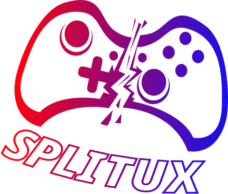
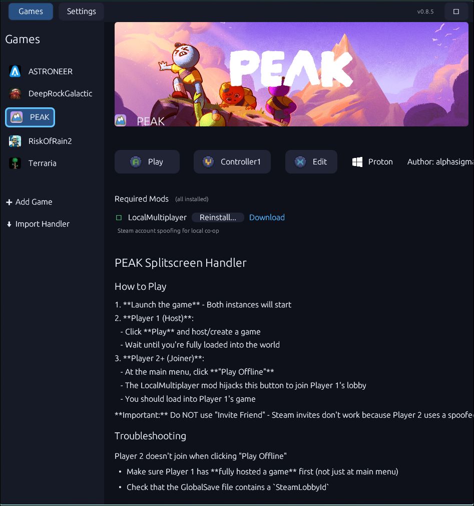
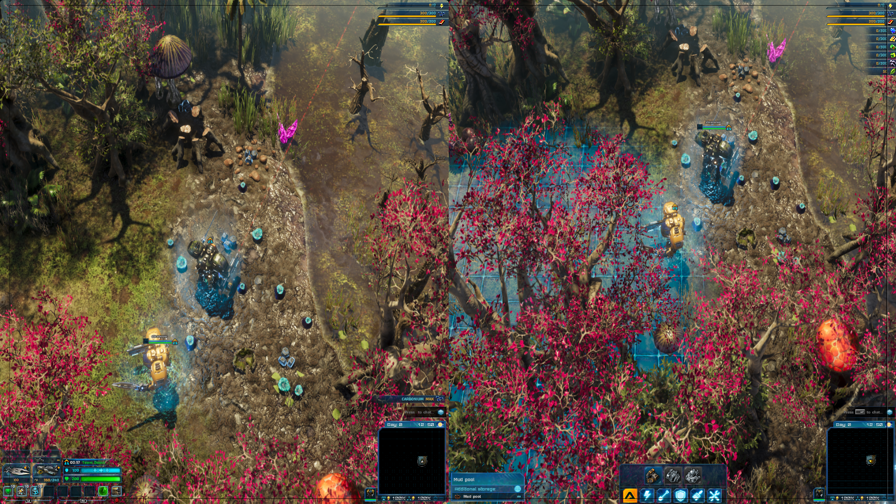
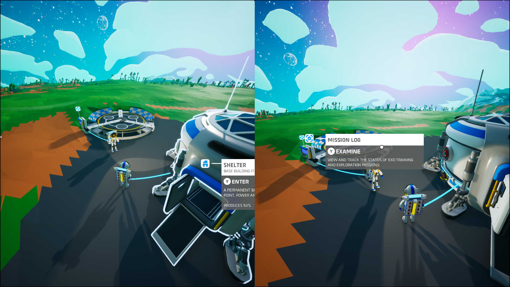
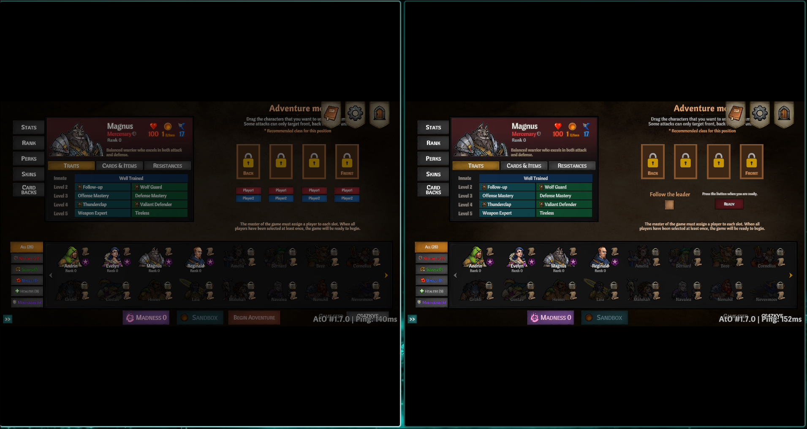

<p align="center">
    
</p>

<p align="center"><em>They killed splitscreen. We brought it back.</em></p>

---

<p align="center">
    
    <br>
    <em>Splitux Launcher - Game selection and configuration</em>
</p>

<p align="center">
    
    <br>
    <em>The Riftbreaker - Co-op base defense on an alien planet</em>
</p>

<p align="center">
    
    <br>
    <em>Astroneer - Co-op base building on an alien planet</em>
</p>

<p align="center">
    
    <br>
    <em>Across The Obelisk - Two players in the same multiplayer lobby</em>
</p>

## Features

- **Split-screen multiplayer** - Run multiple game instances with automatic window tiling
- **Remote play (splitux-together)** - Stream instances to friends' browsers over WebRTC; they play a seat from anywhere
- **Controller isolation** - Each instance only sees its assigned controllers
- **Keyboard & mouse support** - Per-instance input isolation via custom Gamescope fork
- **Steam artwork integration** - Automatically fetches game icons and banners from your local Steam library
- **Steam & Epic LAN emulation** - Play online-only games locally via the Goldberg (Steam) and EOS LAN (Epic Online Services) emulators
- **Proton support** - Run Windows games through Proton/UMU Launcher
- **Per-player profiles** - Separate saves, settings, and Steam identities per player
- **Three ways to drive it** - a gamepad-navigable **GUI**, a keyboard-driven **TUI** (great over SSH), and a fully scriptable **CLI**
- **Multi-game (CLI)** - run several *different* games at once, one per monitor, from a single command
- **niri, Hyprland & KDE Plasma** - Native window manager integration

## How It Works

Splitux launches each game instance inside its own containerized environment:

```
┌────────────────────────────────────────────────────────────┐
│ Splitux                                                    │
│ ┌────────────────┐ ┌────────────────┐ ┌────────────────┐   │
│ │ Gamescope      │ │ Gamescope      │ │ Gamescope      │   │
│ │ ┌────────────┐ │ │ ┌────────────┐ │ │ ┌────────────┐ │   │
│ │ │ Bubblewrap │ │ │ │ Bubblewrap │ │ │ │ Bubblewrap │ │   │
│ │ │ ┌────────┐ │ │ │ │ ┌────────┐ │ │ │ │ ┌────────┐ │ │   │
│ │ │ │  Game  │ │ │ │ │ │  Game  │ │ │ │ │ │  Game  │ │ │   │
│ │ │ └────────┘ │ │ │ │ └────────┘ │ │ │ │ └────────┘ │ │   │
│ │ └────────────┘ │ │ └────────────┘ │ │ └────────────┘ │   │
│ │ Player 1       │ │ Player 2       │ │ Player 3       │   │
│ └────────────────┘ └────────────────┘ └────────────────┘   │
└────────────────────────────────────────────────────────────┘
```

Each instance runs in:
- **Gamescope** - Nested Wayland compositor that contains the game window and handles input
- **Bubblewrap** - Lightweight sandbox that masks input devices and mounts profile-specific directories
- **Overlay filesystem** - Injects multiplayer DLLs and per-player configurations

## Supported Backends

| Backend | Use Case |
|---------|----------|
| **Goldberg** | Steam P2P games - emulates Steam networking (gbe_fork) for LAN play |
| **EOS** | Epic Online Services co-op - LAN-emulates Epic sessions/presence/P2P (UE games, Satisfactory, Palworld, V Rising) |
| **Photon** | Unity Photon games - injects LocalMultiplayer mod via BepInEx |
| **Facepunch** | Unity games using Facepunch.Steamworks - spoofs Steam identity via BepInEx |
| **Standalone** | Games whose own community mods handle multiplayer - installs BepInEx + Thunderstore plugins |
| **None** | Games with native LAN support or single-player |

Backends are auto-detected by the presence of their config block. Multiple backends can coexist (e.g., **EOS + Goldberg**, where EOS carries co-op and Goldberg is the Steam-ownership boot shim).

See **[docs/HANDLER_OPTIONS.md](docs/HANDLER_OPTIONS.md)** for every backend's tuning knobs (including the full `EOSLAN_*` emulator environment).

## Installation

### Requirements

- **Window Manager**: niri, Hyprland, or KDE Plasma
- **Dependencies**: Gamescope, Bubblewrap, fuse-overlayfs, SDL2
- **For remote play (splitux-together)**: PipeWire (instance capture) and a working hardware/software H.264 encoder

### GitHub Releases

All builds are available on the [Releases](https://github.com/splitux-gg/splitux/releases) page:

| Release | Description | When to Use |
|---------|-------------|-------------|
| **Latest** | Stable tagged releases (`v1.0.0`, etc.) | Production use |
| **Nightly** | Built daily at 4 AM UTC from `main` | Latest features, may be unstable |

Available formats:
- `.AppImage` - Portable, no installation required
- `.flatpak` - Sandboxed with automatic dependencies
- `.tar.gz` / `.zip` - Native installation

### AppImage (Recommended)

The easiest way to run Splitux. No installation required.

```bash
# Download latest stable
curl -LO https://github.com/splitux-gg/splitux/releases/latest/download/Splitux-x86_64.AppImage

# Or download nightly (latest features, may be unstable)
curl -LO https://github.com/splitux-gg/splitux/releases/download/nightly/Splitux-nightly-x86_64.AppImage

# Make executable and run
chmod +x Splitux-*.AppImage
./Splitux-*.AppImage
```

**Add to app launcher:**
```bash
# Move to a permanent location
mkdir -p ~/.local/bin
mv Splitux-*.AppImage ~/.local/bin/Splitux.AppImage

# Create desktop entry
cat > ~/.local/share/applications/splitux.desktop << 'EOF'
[Desktop Entry]
Name=Splitux
Comment=Local co-op split-screen gaming for Linux
Exec=$HOME/.local/bin/Splitux.AppImage
Icon=splitux
Terminal=false
Type=Application
Categories=Game;
EOF
```

### Flatpak

Sandboxed installation with automatic dependency management.

```bash
# Download latest stable
curl -LO https://github.com/splitux-gg/splitux/releases/latest/download/Splitux.flatpak

# Or download nightly
curl -LO https://github.com/splitux-gg/splitux/releases/download/nightly/Splitux-nightly.flatpak

# Install
flatpak install --user Splitux*.flatpak

# Run
flatpak run gg.splitux.Splitux
```

Flatpak automatically adds Splitux to your app launcher after installation.

### Tarball (Native)

Traditional installation for maximum performance.

```bash
# Download and extract
curl -LO https://github.com/splitux-gg/splitux/releases/latest/download/splitux-linux-x86_64.tar.gz
tar -xzf splitux-linux-x86_64.tar.gz
cd splitux

# Run directly
./splitux

# Or install to ~/.local (adds to app launcher)
./install.sh
```

**Note:** The tarball requires these dependencies to be installed on your system:
- `gamescope` or use the bundled `gamescope-splitux` in `bin/`
- `bubblewrap`
- `fuse-overlayfs`
- `SDL2`

### Building from Source

Requires Rust 1.85+ (for edition 2024), meson, and ninja.

```bash
git clone --recurse-submodules https://github.com/splitux-gg/splitux.git
cd splitux
cargo build --release
```

The binary will be at `target/release/splitux`. Bundled dependencies live in `assets/`; at runtime splitux looks for them under a system install (`/usr/share/splitux`), a user install (`~/.local/share/splitux`), and finally `assets/` next to the binary.

## Configuration

Settings are stored in `~/.local/share/splitux/`:

```
splitux/
├── handlers/           # Game configurations (handler.yaml + assets)
├── profiles/           # Per-player save data and settings
├── prefixes/           # Wine prefixes for Windows games
└── settings.json       # Global configuration
```

### Handler Format

Games are configured via YAML handlers using nested backend blocks. A handler
needs three fields plus a way to find the game, then one backend block:

```yaml
name: Game Name
exec: game.exe
spec_ver: 3
steam_appid: 12345

# Goldberg backend (auto-detected by the block being present)
goldberg:
  settings:
    force_lobby_type.txt: "2"
    invite_all.txt: ""

# Optional launch settings
args: "-windowed"
env: "DXVK_ASYNC=1"
proton_path: "Proton - Experimental"
pause_between_starts: 5.0
```

**Backend examples:**

```yaml
# EOS (Epic Online Services co-op via the EOS LAN emu)
eos:
  appid: "MyGame"
  enable_lan: true
  disable_online_networking: true
env: "EOSLAN_LOCALHOST_MODE=1"   # EOS emu tuning goes through env (EOSLAN_*)

# Photon (Unity games with BepInEx mod)
photon:
  config_path: "AppData/LocalLow/Company/Game/config.cfg"
  shared_files:
    - "AppData/LocalLow/Company/Game/SharedSave"

# Facepunch (Unity games using Facepunch.Steamworks)
facepunch:
  spoof_identity: true
  force_valid: true
  photon_bypass: true
```

Start from [`assets/handler_template.yaml`](assets/handler_template.yaml) and see
**[docs/HANDLER_OPTIONS.md](docs/HANDLER_OPTIONS.md)** for the complete field and
emulator-tuning reference. Or browse and download community handlers from the
in-app handler registry.

> Older handlers written in dot-notation (`goldberg.settings.x.txt: "2"`) and the
> legacy `backend:` form still load — they're expanded/migrated automatically —
> but new handlers should use nested blocks.

## Window Layouts

Each player count has selectable layout presets, chosen per-count in the launcher:

- **2P**: Top / Bottom, Side by Side
- **3P**: Side by Side, Stacked
- **4P**: Grid, Rows, Columns
- **Fullscreen ("Independent")**: every instance gets its own full-resolution
  output instead of a tile — useful for multi-monitor setups and for remote
  (splitux-together) seats. With more instances than displays, the ones that
  have to share an output are tiled side-by-side so every player stays visible
  (rather than stacking, where only the focused window shows).

Window placement is handled natively per WM (niri, Hyprland, KWin). Launched game
processes are contained in a systemd cgroup scope tied to splitux, so a crash or
exit cleans up every child (gamescope, Proton, wine) with it.

## Remote Play (splitux-together)

splitux-together streams launched instances to friends over the internet — no
splitscreen required. When enabled, each instance gets a seat-streamer sidecar
that owns a virtual gamepad/keyboard/mouse and captures that instance's gamescope
output over PipeWire, H.264-encoding it to a remote browser over WebRTC.

splitux shows one invite URL per seat (`{base}/j/{token}`); hand each link to a
friend, who opens it in a browser and auto-joins that seat. Their input drives the
instance exactly like a local controller. Combine with the **Fullscreen** layout
so each remote player gets a full-resolution stream.

## Three Ways to Drive It

Splitux has one launch engine behind three front-ends, each suited to a different job:

| Front-end | Best for | Multi-game | How to open |
|-----------|----------|:----------:|-------------|
| **GUI** | Couch use, gamepad-navigable, the most explicit setup | single-game by design | `splitux` (no subcommand) |
| **TUI** | Keyboard-driven, works great over SSH; pick game, assign players, watch/kill/restart sessions | single-game by design | `splitux tui` |
| **CLI** | Scripting and automation; exposes every feature | **yes** | `splitux <subcommand>` |

The GUI and TUI are deliberately **single-game** — one game, configured explicitly per session. **Multi-game** (several *different* games at once) is a CLI capability, because that's the surface used for scripted/automated launches. All three call the same scan + launch pipeline, so behavior never diverges.

## Headless CLI

Discover and launch sessions without the GUI — handy over SSH or from a script. A
plain `splitux` (no subcommand) still opens the GUI; `splitux tui` opens the
terminal UI.

### Inspect the machine

```bash
splitux list games       # installed game handlers
splitux list profiles    # player profiles
splitux list inputs       # gamepads / keyboards / mice
splitux list monitors    # connectors + resolutions (for --display)
splitux list layouts     # valid layout presets per player count
```

### Launch a session

One `--player` per seat. `--player` takes comma-separated `key=val`:

- `profile=<name>` — player profile (default `Guest`; see `list profiles`)
- `input=<spec>` — `local:kbm` | `local:gamepad` | `together:kbm` | `together:gamepad`
  (`local:*` drives the host directly; `together:*` is a remote streamed seat)
- `game=<name>` — which `--game` this player belongs to (multi-game only)

```bash
# Two local players, side-by-side split on the primary display
splitux launch --game "Satisfactory" \
  --player profile=Gabe,input=local:kbm \
  --player profile=Ruth,input=local:gamepad \
  --layout vertical

# One player per monitor, each rendered fullscreen
splitux launch --game "Palworld" \
  --player profile=Alice,input=local:kbm \
  --player profile=Bob,input=local:gamepad \
  --layout fullscreen --display DP-1 --display HDMI-A-1

# Two remote (together) seats — hand each player their invite URL
splitux launch --game "Satisfactory" \
  --player profile=Gabe,input=together:gamepad \
  --player profile=Ruth,input=together:kbm
```

**Layout / display overrides** (per launch, overriding `settings.json`):

- `--layout <vertical|horizontal|grid|fullscreen>` — valid presets depend on
  player count (see `list layouts`).
- `--display <connector>` — repeatable. One value puts all instances on that
  monitor; several distribute them across monitors (1:1 when counts match, else
  round-robin). Two instances forced onto one display tile side-by-side.

**Save anchoring** — carry a player's real progress in and sync it back:

- `--master <profile>` — the profile that owns the canonical save.
- `--save-anchor <path>` — original save to seed the master from (overrides the
  handler's `original_save_path`).
- `--save-sync-back` — write the master's saves back to the anchor when the
  session ends (the original is always backed up first).
- `--save-steam-id-remap` — remap Steam IDs embedded in save filenames (DRG-style).

### Multi-game (CLI only)

Pass `--game` more than once to run several **different** games concurrently in
one coordinated session (one process, serialized bring-up — no inter-game race).
Every `--player` then needs a `game=<name>` tag, and `--layout`/`--display`
become game-tagged `<game>=<value>`:

```bash
splitux launch --game Satisfactory --game Palworld \
  --player game=Satisfactory,profile=Gabe,input=local:gamepad \
  --player game=Satisfactory,profile=Ruth,input=local:gamepad \
  --player game=Palworld,profile=Alice,input=together:gamepad \
  --layout Satisfactory=vertical \
  --display Satisfactory=DP-2 --display Palworld=HDMI-A-1
```

### Templates & completions

```bash
# Save a reusable, pinned session template (shows up in the GUI/TUI session list)
splitux save-session --game "Satisfactory" \
  --player profile=Gabe,input=local:gamepad --name "Sat duo"

# Shell completions (bash | zsh | fish | elvish | powershell)
splitux completions zsh > ~/.zfunc/_splitux
```

Run `splitux launch --help` for the complete, authoritative flag reference.

## Terminal UI (TUI)

`splitux tui` is a keyboard-driven, ratatui front-end — a full GUI replacement
that works cleanly over SSH. Pick a game, assemble players (profile, input,
local/together), choose a window layout and a per-player display, then launch the
session *detached* so the TUI stays live to watch, kill, and restart running
sessions.

Build-screen keys: `a` add / `d` delete player · `p` profile · `i` input · `m`
display · `t` local/together · `L` layout · `c` save-anchor · `Enter` launch ·
`s` sessions. The display picker only appears with more than one monitor, and the
layout picker only offers presets valid for the current player count. Like the
GUI, the TUI is single-game per session; reach for the CLI for multi-game.

## Controls

The launcher is fully navigable with a gamepad:

| Input | Action |
|-------|--------|
| D-Pad / Left Stick | Navigate |
| A | Select / Confirm |
| B | Back |
| Y | Change Profile |
| X | Edit Handler |
| Start | Launch Game |
| LB / RB | Switch Tabs |
| Right Stick | Scroll |

## Troubleshooting

A game crashes the instant it launches (window flashes, then `Primary child shut down`),
with a native crash in `GetJoystickNames` / SDL? A non-gamepad input device (e.g. a
keyboard's "System Control" endpoint) is likely mis-tagged as a joystick and trips the
game's old bundled SDL. See **[docs/input-device-troubleshooting.md](docs/input-device-troubleshooting.md)**
and the udev template in `docs/udev/`.

## License

MIT License - see [LICENSE](LICENSE)

## Acknowledgments

- [PartyDeck](https://github.com/Seezeed7/PartyDeck) - Original inspiration for split-screen gaming on Linux
- [Gamescope](https://github.com/ValveSoftware/gamescope) - Wayland compositor by Valve
- [Goldberg Steam Emulator](https://github.com/Detanup01/gbe_fork) - Steam API emulation
- [UMU Launcher](https://github.com/Open-Wine-Components/umu-launcher) - Proton launcher
- [Nucleus Co-op](https://github.com/SplitScreen-Me/splitscreenme-nucleus) - Split-screen gaming on Windows
